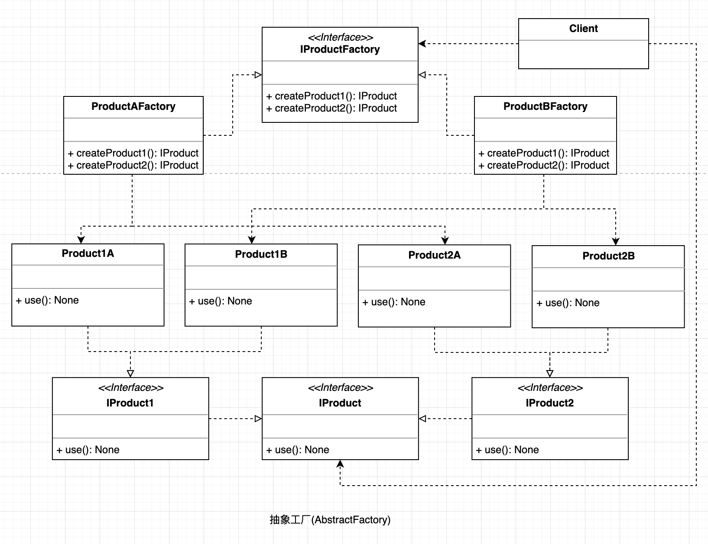

## 抽象工厂
是一种为访问类提供一个创建一组相关或相互依赖对象的接口，且访问类无须指定所要产品的具体类就能得到同族的不同等级的产品的模式结构。

抽象工厂模式是工厂方法模式的升级版本，工厂方法模式只生产一个等级的产品，而抽象工厂模式可生产多个等级的产品。

#### UML

  

#### 使用场景

* 当需要创建的对象是一系列相互关联或相互依赖的产品族时，如电器工厂中的电视机、洗衣机、空调等
* 系统中有多个产品族，但每次只使用其中的某一族产品。如有人只喜欢穿某一个品牌的衣服和鞋。
* 系统中提供了产品的类库，且所有产品的接口相同，客户端不依赖产品实例的创建细节和内部结构。

#### 优点

* 可以在类的内部对产品族中相关联的多等级产品共同管理，而不必专门引入多个新的类来进行管理。
* 当增加一个新的产品族时不需要修改原代码，满足开闭原则。

#### 缺点

* 当产品族中需要增加一个新的产品时，所有的工厂类都需要进行修改。

#### 场景案例

抽象工厂模式最早的应用是用于创建属于不同操作系统的视窗构件。如 java 的 AWT 中的 Button 和 Text 等构件在 Windows 和 UNIX 中的本地实现是不同的。
