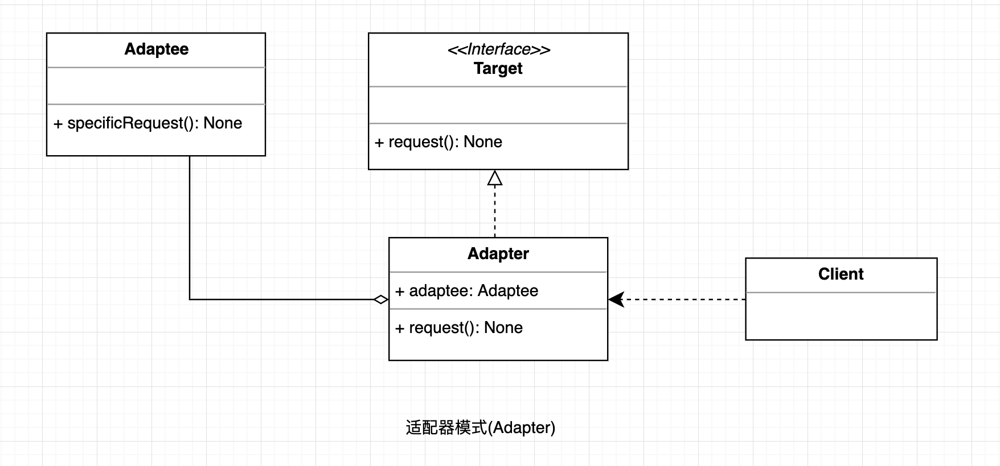

## 适配器模式

适配器模式（Adapter）的定义如下：将一个类的接口转换成客户希望的另外一个接口，使得原本由于接口不兼容而不能一起工作的那些类能一起工作。

#### UML

  

#### 使用场景

* 以前开发的系统存在满足新系统功能需求的类，但其接口同新系统的接口不一致。
* 使用第三方提供的组件，但组件接口定义和自己要求的接口定义不同。

#### 优点

* 客户端通过适配器可以透明地调用目标接口。
* 复用了现存的类，程序员不需要修改原有代码而重用现有的适配者类。
* 将目标类和适配者类解耦，解决了目标类和适配者类接口不一致的问题。

#### 缺点

* 类适配器来说，更换适配器的实现过程比较复杂。
