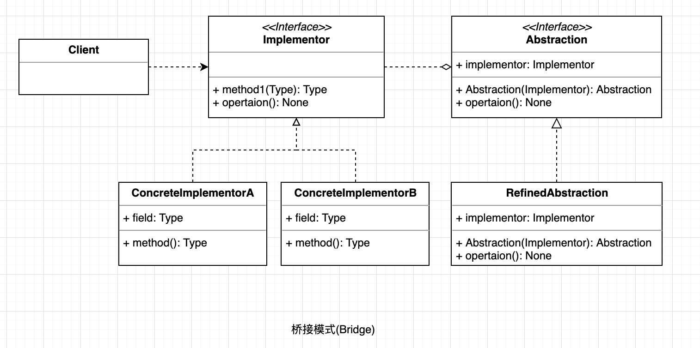

## 桥接模式

桥接（Bridge）模式：将抽象与实现解藕，使它们可以独立变化。通过组合关系代替继承关系来实现，从而降低了抽象和实现这两个可变维度的耦合度。

#### UML

  

#### 使用场景

* 当一个类存在两个独立变化的维度，且这两个维度都需要进行扩展时。
* 当一个系统不希望使用继承或因为多层次继承导致系统类的个数急剧增加时。
* 当一个系统需要在构件的抽象化角色和具体化角色之间增加更多的灵活性时。

#### 优点
* 由于抽象与实现分离，所以扩展能力强；
* 其实现细节对客户透明。

#### 缺点

* 由于聚合关系建立在抽象层，要求开发者针对抽象化进行设计与编程，这增加了系统的理解与设计难度。
