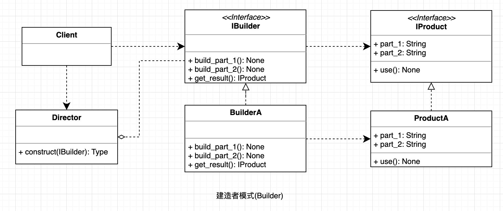

## 建造者模式
指将一个复杂对象的构造与它的表示分离，使同样的构建过程可以创建不同的表示，这样的设计模式被称为建造者模式。

它是将一个复杂的对象分解为多个简单的对象，然后一步一步构建而成。它将变与不变相分离，即产品的组成部分是不变的，但每一部分是可以灵活选择的。

#### UML

  

#### 使用场景

   建造者（Builder）模式创建的是复杂对象，其产品的各个部分经常面临着剧烈的变化，但将它们组合在一起的算法却相对稳定，所以它通常在以下场合使用。
   
   * 创建的对象较复杂，由多个部件构成，各部件面临着复杂的变化，但构件间的建造顺序是稳定的。
   * 创建复杂对象的算法独立于该对象的组成部分以及它们的装配方式，即产品的构建过程和最终的表示是独立的。

#### 优点

* 各个具体的建造者相互独立，有利于系统的扩展。
* 客户端不必知道产品内部组成的细节，便于控制细节风险。

#### 缺点

* 产品的组成部分必须相同，这限制了其使用范围。
* 如果产品的内部变化复杂，该模式会增加很多的建造者类。

