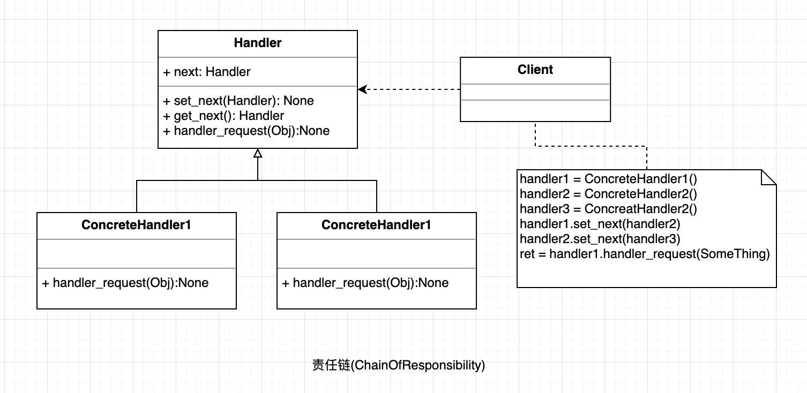

## 责任链

为请求创建了一个接收者对象的链。如果一个对象不能处理该请求，那么它会把相同的请求传给下一个接收者，依此类推。

#### UML

  

#### 使用场景;

* 有多个对象可以处理同一个请求，具体哪个对象处理该请求由运行时刻自动确定。 
* 在不明确指定接收者的情况下，向多个对象中的一个提交一个请求。 
* 可动态指定一组对象处理请求。

#### 优点

* 降低耦合度。它将请求的发送者和接收者解耦。 
* 简化了对象。使得对象不需要知道链的结构。 
* 增强给对象指派职责的灵活性。通过改变链内的成员或者调动它们的次序，允许动态地新增或者删除责任。 
* 增加新的请求处理类很方便。

#### 缺点

* 不能保证请求一定被接收。 
* 系统性能将受到一定影响，而且在进行代码调试时不太方便，可能会造成循环调用。 
* 可能不容易观察运行时的特征，有碍于除错。

#### 场景案例

* 各种Web开发中的中间键
