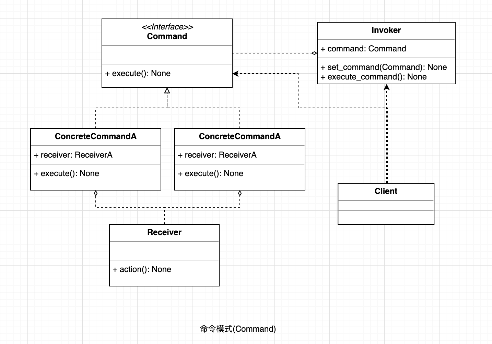

## 命令模式

将一个请求封装成一个对象，从而使您可以用不同的请求对客户进行参数化。

#### UML

  

#### 使用场景;

* 当系统需要将请求调用者与请求接收者解耦时，命令模式使得调用者和接收者不直接交互。
* 当系统需要随机请求命令或经常增加或删除命令时，命令模式比较方便实现这些功能。
* 当系统需要执行一组操作时，命令模式可以定义宏命令来实现该功能。
* 当系统需要支持命令的撤销（Undo）操作和恢复（Redo）操作时，可以将命令对象存储起来，采用备忘录模式来实现。

#### 优点

* 降低了系统耦合度。 
* 新的命令可以很容易添加到系统中去。
* 把请求一个操作的对象与指导怎么执行一个操作的对象分隔开。

#### 缺点

* 可能产生大量具体命令类。因为计对每一个具体操作都需要设计一个具体命令类，这将增加系统的复杂性。

#### 场景案例

* struts 中的 action 核心控制器 ActionServlet 只有一个，相当于 Invoker，而模型层的类会随着不同的应用有不同的模型类，相当于具体的 Command。
