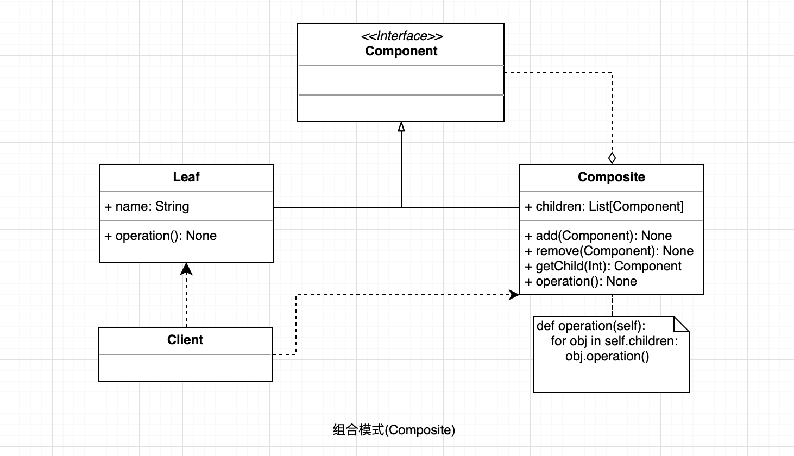

## 组合模式

将对象组合成树结构的模式, 用来表示"部分-整体"的关系，使用户对单个对象和组合对象具有一致的访问性。

#### UML

  

#### 使用场景;

* 当客户端或略组合和单个对象之间的差异时，可以使用组合模式。

#### 优点

* 组合模式使得客户端代码可以一致地处理单个对象和组合对象，无须关心自己处理的是单个对象，还是组合对象，这简化了客户端代码。
* 更容易在组合体内加入新的对象，客户端不会因为加入了新的对象而更改源代码，满足“开闭原则”。

#### 缺点

* 设计较复杂，客户端需要花更多时间理清类之间的层次关系。
* 不容易限制容器中的构件。
* 不容易用继承的方法来增加构件的新功能。
