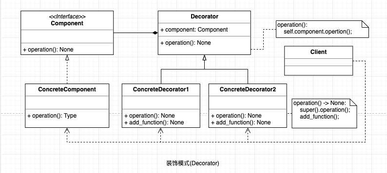

## 装饰模式

在不改变现有对象结构的情况下，动态地给该对象增加一些职责（即增加其额外功能）的模式，属于对象结构型模式。

#### UML

  

#### 使用场景

* 当需要给一个现有类添加附加职责，而又不能采用生成子类的方法进行扩充时。例如，该类被隐藏或者该类是终极类或者采用继承方式会产生大量的子类。
* 当需要通过对现有的一组基本功能进行排列组合而产生非常多的功能时，采用继承关系很难实现，而采用装饰模式却很好实现。
* 当对象的功能要求可以动态地添加，也可以再动态地撤销时。

#### 优点

* 采用装饰模式扩展对象的功能比采用继承方式更加灵活。
* 可以设计出多个不同的具体装饰类，创造出多个不同行为的组合。

#### 缺点

* 装饰模式增加了许多子类，如果过度使用会使程序变得很复杂。

#### 应用场景: 

最著名的应用莫过于 Java I/O 标准库的设计了。
* InputStream 的子类 FilterInputStream
* OutputStream 的子类 FilterOutputStream 
* Reader 的子类 BufferedReader

