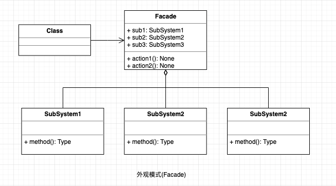

## 外观模式(门面模式)
为多个复杂的子系统提供一个统一的接口，使得这些子系统更加容易被访问。

#### UML

  

#### 使用场景

* 对分层结构系统构建时，使用外观模式定义子系统中每层的入口点可以简化子系统之间的依赖关系。
* 当一个复杂系统的子系统很多时，外观模式可以为系统设计一个简单的接口供外界访问。
* 当客户端与多个子系统之间存在很大的联系时，引入外观模式可将它们分离，从而提高子系统的独立性和可移植性。

#### 优点

* 降低了子系统与客服端之间的耦合度，使得子系统的变化不会影响调用它的客户类。
* 对客户屏蔽了子系统的组件，减少了客户端调用对象，使得子系统使用起来更加容易。

#### 缺点

* 增加子系统需要修改外观类或客户端的源代码，违背了"开闭原则", 并且修改代码很麻烦。

#### 使用场景: 

* 各种api gateway
* JAVA 的三层开发模式。
* 去医院看病，可能要去挂号、门诊、划价、取药，让患者或患者家属觉得很复杂，如果有提供接待人员，只让接待人员来处理，就很方便。

