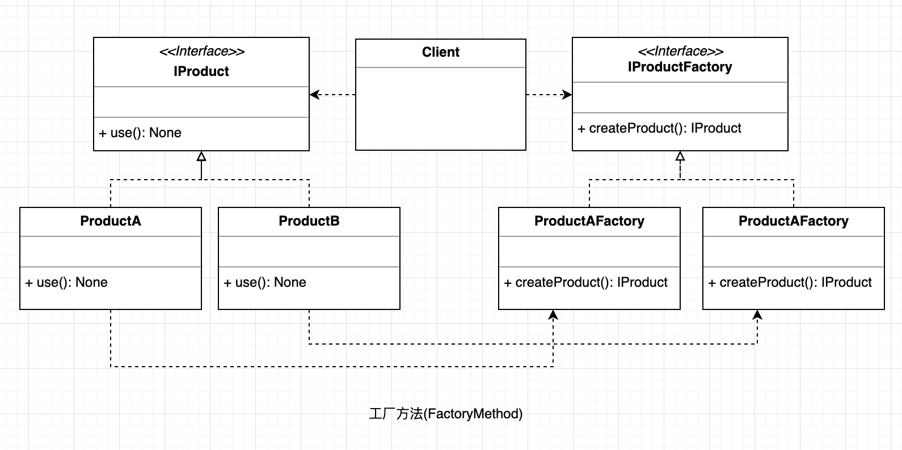

## 工厂方法
定义一个创建产品对象的工厂接口，将产品对象的实际创建工作推迟到具体子工厂类当中。是对简单工厂模式的进一步抽象化，其好处是可以使系统在不修改原来代码的情况下引进新的产品，即满足开闭原则。

#### UML

  

#### 使用场景
我们明确地计划不同条件下创建不同实例时。

#### 优点

* 一个调用者想创建一个对象，只要知道其名称就可以了。 
* 扩展性高，如果想增加一个产品，只要扩展一个工厂类就可以。 
* 屏蔽产品的具体实现，调用者只关心产品的接口。

#### 缺点

每次增加一个产品时，都需要增加一个具体类和对象实现工厂，使得系统中类的个数成倍增加，在一定程度上增加了系统的复杂度，同时也增加了系统具体类的依赖。

#### 使用场景: 
1. 日志记录器: 

    记录可能记录到本地硬盘、系统事件、远程服务器等，用户可以选择记录日志到什么地方。 
2. 数据库访问: 

    当用户不知道最后系统采用哪一类数据库，以及数据库可能有变化时。 

