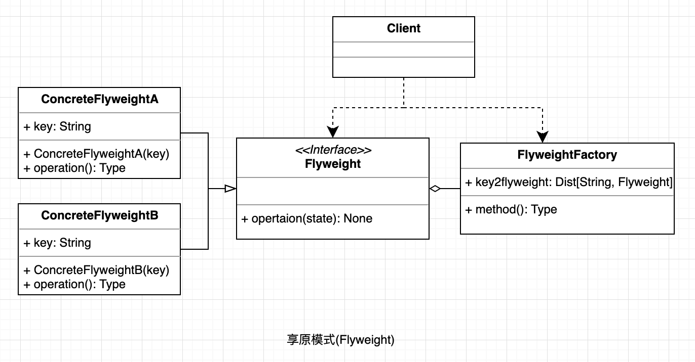

## 享原模式
通过细粒度的共享技术减少创建对象的数量，以减少内存占用和提高性能。这种类型的设计模式属于结构型模式，它提供了减少对象数量从而改善应用所需的对象结构的方式。

#### UML

  

#### 使用场景
* 系统中存在大量相同或相似的对象，这些对象耗费大量的内存资源。
* 大部分的对象可以按照内部状态进行分组，且可将不同部分外部化，这样每一个组只需保存一个内部状态。
* 由于享元模式需要额外维护一个保存享元的数据结构，所以应当在有足够多的享元实例时才值得使用享元模式。

#### 优点
* 大大减少对象的创建，降低系统的内存，使效率提高。

#### 缺点
*提高了系统的复杂度，需要分离出外部状态和内部状态，而且外部状态具有固有化的性质，不应该随着内部状态的变化而变化，否则会造成系统的混乱。

#### 场景案例: 

* JAVA 中的 String，如果有则返回，如果没有则创建一个字符串保存在字符串缓存池里面。

