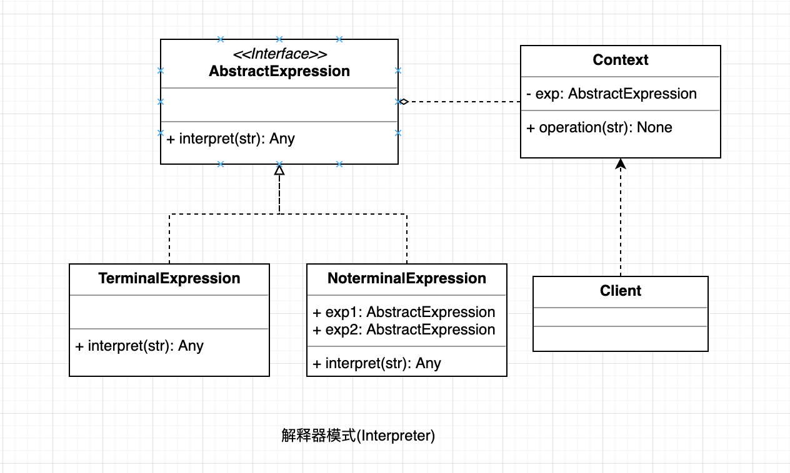

## 解释器模式

给分析对象定义一个语言，并定义该语言的问法表示，在设计一个解释器来解释语言中的句子。

#### UML

  

#### 使用场景

* 可以将一个需要解释执行的语言中的句子表示为一个抽象语法树。 
* 一些重复出现的问题可以用一种简单的语言来进行表达。 
* 一个简单语法需要解释的场景。

#### 优点

* 可扩展性比较好，灵活。 
* 增加了新的解释表达式的方式。
* 易于实现简单文法。

#### 缺点

* 可利用场景比较少。 
* 对于复杂的文法比较难维护。 
* 解释器模式会引起类膨胀。 
* 解释器模式采用递归调用方法。

#### 场景案例: 

* JAVA 中的 String，如果有则返回，如果没有则创建一个字符串保存在字符串缓存池里面。

