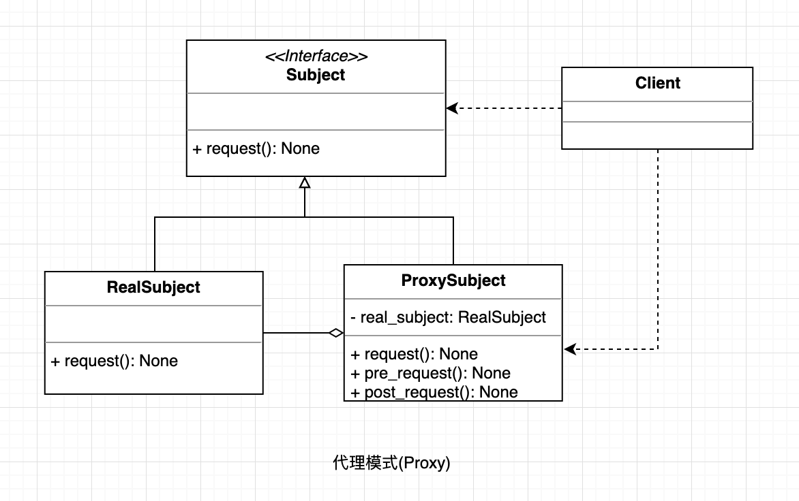

## 代理模式
由于某些原因需要给某对象提供一个代理以控制对该对象的访问。这时，访问对象不适合或者不能直接引用目标对象，代理对象作为访问对象和目标对象之间的中介。

#### UML

  

#### 使用场景

需要在访问一个类时做一些控制的时候。

#### 优点

* 职责清晰
* 代理对象可以扩展目标对象的功能
* 将客户端与目标对象分离，在一定程度上降低了系统的耦合度

#### 缺点

* 在客户端和目标对象之间增加一个代理对象，会造成请求处理速度变慢；
* 增加了系统的复杂度；

#### 场景案例

* Windows 里面的快捷方式。 
* spring aop。

