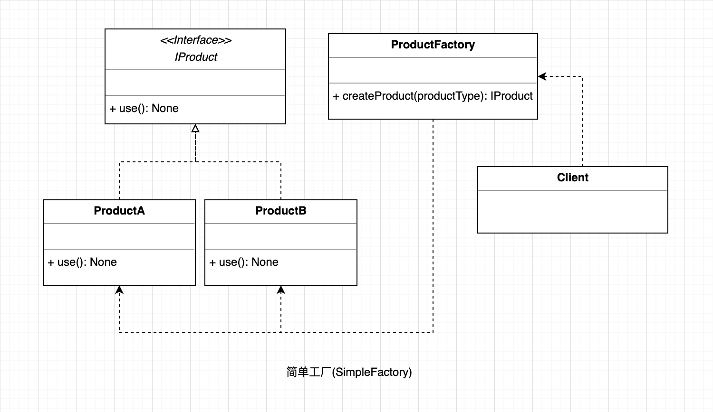

## 简单工厂
简单工厂模式是属于创建型模式，又叫做静态工厂方法（Static Factory Method）模式，但不属于23种GOF设计模式之一。简单工厂模式是由一个工厂对象决定创建出哪一种产品类的实例。简单工厂模式是工厂模式家族中最简单实用的模式，可以理解为是不同工厂模式的一个特殊实现。
#### UML

  
 

#### 使用场景
工厂类负责创建的对象比较少；
客户只知道传入工厂类的参数，对于如何创建对象（逻辑）不关心；
由于简单工厂很容易违反高内聚责任分配原则，因此一般只在很简单的情况下应用。

#### 优点
* 工厂类是整个模式的关键.包含了必要的逻辑判断,根据外界给定的信息,决定究竟应该创建哪个具体类的对象.通过使用工厂类,外界可以从直接创建具体产品对象的尴尬局面摆脱出来,
仅仅需要负责“消费”对象就可以了。而不必管这些对象究竟如何创建及如何组织的．明确了各自的职责和权利，有利于整个软件体系结构的优化。

#### 缺点
* 由于工厂类集中了所有实例的创建逻辑，违反了高内聚责任分配原则，将全部创建逻辑集中到了一个工厂类中；它所能创建的类只能是事先考虑到的，如果需要添加新的类，则就需要改变工厂类了。
* 当系统中的具体产品类不断增多时候，可能会出现要求工厂类根据不同条件创建不同实例的需求．这种对条件的判断和对具体产品类型的判断交错在一起，很难避免模块功能的蔓延，对系统的维护和扩展非常不利；

