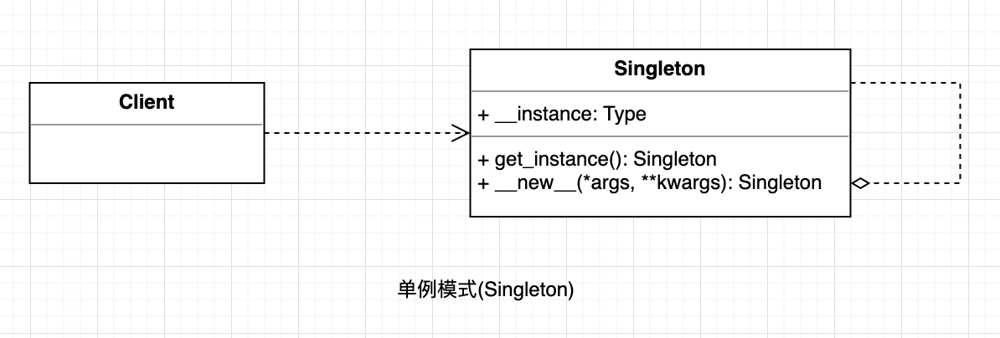

## 单例模式
指一个类只有一个实例，且该类能自行创建这个实例的一种模式，并提供一个访问它的全局方法。

ps: Python 的模块就是天然的单例模式。(Simple is better than complex)

#### UML

  

#### 使用场景

* 希望这个类有且只有一个实例(比如这类在占用大量资源，希望复用的时候)

#### 优点

* 保证一个类仅有一个实例, 并提供一个访问他的全局访问点

#### 缺点

* 多进程, 要考虑加锁
* web时, 往往是多进程起
* web时, 扩容时还往往是多机器多实例

#### 场景案例
例如，Windows 中只能打开一个任务管理器，这样可以避免因打开多个任务管理器窗口而造成内存资源的浪费，或出现各个窗口显示内容的不一致等错误。
在计算机系统中，还有 Windows 的回收站、操作系统中的文件系统、多线程中的线程池、显卡的驱动程序对象、打印机的后台处理服务、应用程序的日志对象、数据库的连接池、网站的计数器、Web 应用的配置对象、应用程序中的对话框、系统中的缓存等常常被设计成单例。

